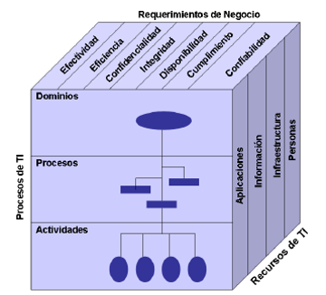

# SQL server

Es un sistema de gestor de base de datos relacionales eso significa que trabaja con tablas que se conectan entre si.

- **DDL ( Data Definicion language )** 
    - CREATE
    - ALTER
    - DROP
    - TRUNCATE

- **DML ( Data MAnipulation language )**  
    - INSERT
    - UPDATE
    - DELATE

- **DQL ( Date Query Language )**
    - SELECT

- **DCL ( Data Control Language )**
    - GARANT
    - REVOKE

- **TPL (Transaction Control Language)**
    - COMMIT
    - ROLLBACK

Oracle -> PL/SQL  
SQL server -> TSQL "*Transact SQL*"  
Postgress -> PSQL

# Gobierno de datos

Es un sistema que rige como se manejas los datos en una prganizacion quien tiene acceso a ellos como se almacenan y que los datos sean claros y corectos

Para saber si se esta hacienod un buen gobierno de datos se le pone una nota

## Roles

- **Data owner** el dueño de los datos decide quien y como se ven los datos
- **Data steward** es el que se asegura que se haga lo que el owner pide mas que todo se encarga de cuidar los datos
- **Data custodian(DBA)** el administrador de base de datos el que cuida la base de datos el que administra y protege

- Calidad de datos
- Seguridad de datos
- Complimineto normativo
- Roles y responsabilidad
    - Usuario -> Rol -> Privilegio
    
## Dimensiones de calida (KPIs)

el steward se fija en estas reglas para ponerle una nota a los datos

- **Exactitud** que los datos sean exactos que digan la verdad
- **Completitut** que datos faltan
- **Consistencia** que el dato sea el mismo en todos lados
- **Oportunidad** el dato llega a tiempo para tomar deciciones

## Modelo de marudez

Existen niveles para saber como va el gobiurno de datos

- Nivel 1 -> caos, no hay reglas ni nada
- Nivel 2 -> ya estan definidos los roles
- Nivel 3 -> automatizacion el sistema ya sabe cuando hay problemas y lo avisa al responsable
- Nivel 4 -> la empresa predice errores antes de que pasen

      Un DBA debe poner en practia estas tecnicas en la base de datos ya que el gobierno de datos dicta que los datos sonsensibles y hay que clasisificarlos y tratarlos de maneras distintas

## Ofuscacion
es uan tecnica para proteger los datos no todos podrian ver todo, por ejemplo numeros de terjetas de credito o numeros de telefonos, esos datos deberian estar afuscado para que nadie externo los pueda leer. ej:

|Nombre|Telefono|
|:--:|:--:|
|Juan|xxxxx20|
|Joaquin|xxxxx30|

Esto sirve por si un desarollador necesita hacer cambios pero el no deberia ver los numeros de telefono entonces se les aplica este formato pueden ser x o *

## Clasificacion de datos

ver que datos son sensibles que columnas son privadas y de arta importancia

# Estructuras de almacenamiento

### 1.1 Datos como un activo organizacional

Los datos por si solos no representan nada.

### 1.2 Administracion de datos

**Normalizacion** para evitar la redundancia de datos es su principal objetivo y que haya coerencia de datos.

- **1FN** atomicidad qye en un campo no haya mas de un dato ej telefo que alguien no tenga en una fila no tenga 2 telefonos

- **2FN**  todas las columnas que no son llaves deben depender de una llave primaria, las que no tengan que ver con la llave primaria tienen que llevarse a otra tabla

- **3FN** si un dato depende de otro que no es una llave primaria pues deben separarse

## Ejericios:

### Ejericio 1:

| ID_Inscripcion | Nombre_Alumno | Email_Alumno | Curso | Instructor | Precio_Curso |
| :--- | :--- | :--- | :--- | :--- | :--- |
| 1 | Carlos Perez | carlos@mail.com | SQL Básico | Profe Juan | 50 USD |
| 2 | Carlos Perez | carlos@mail.com | Python 101 | Profe Ana | 60 USD |
| 3 | Marta Ruiz | marta@mail.com | SQL Básico | Profe Juan | 50 USD |
| 4 | Carlos Perez | carlos@mail.com | Power BI | Profe Luis | 70 USD |

 

**Tabla alumnos**
|ID_Alumno(PK)|Nombre_Alumno|Email_Alumno|
|:--:|:--:|:--:|
|1|Carlos Perez|carlos@mail.com|
|2|Marta Ruiz|marta@mail.com|

 

**Tabla profesores**
|ID_Profesor(PK)|Nombre_profesor|
|:--:|:--:|
|1|Profe juan|
|2|Profe Ana|
|3|profe luis|

 

**Tabla cursos**
|ID_curso(PK)|Nombre_curso|ID_Profesor(FK)|Precio|
|:--:|:--:|:--:|:--:|
|1|SQL basico|1|50 USD|
|2|Python 101|1|60 USD|
|3|Power Bl|3|70 USD|

 

**Tabla inscripcion**
|ID_Inscripcion(PK)|ID_Alumno(FK)|ID_curso(FK)|
|:--:|:--:|:--:|
|1|1|1|
|2|1|2|
|3|2|1|
|4|1|3|

### Ejercicio 2:

| ID_Venta | Cliente | Ciudad_Cliente | Producto | Categoria | Cantidad | Precio_Unitario | Fecha_Venta |
| :--- | :--- | :--- | :--- | :--- | :--- | :--- | :--- |
| 501 | Ana Ramos | Madrid | Mouse Logi | Accesorios | 2 | 25.00 | 2024-01-10 |
| 501 | Ana Ramos | Madrid | Teclado Mec | Accesorios | 1 | 80.00 | 2024-01-10 |
| 502 | Luis Paez | Bogotá | Mouse Logi | Accesorios | 1 | 25.00 | 2024-01-11 |
| 503 | Ana Ramos | Madrid | Monitor 4K | Pantallas | 1 | 400.00 | 2024-01-12 |

 

**Tabla ciudad**
|id_ciudad(PK)|ciudad|
|:--:|:--:|
|1|Madrid|
|2|Bogota|

 

**Tabla cliente**
|id_cliente(PK)|nombre_cliente|id_ciudad(FK)|
|:--:|:--:|:--:|
|1|Ana Ramos|1|
|2|Luis Perez|2|

 

**Tabla categoria**
|id_categoria(PK)|categoria|
|:--:|:--:|
|1|Accesosrios|
|2|Pantallas|

 

**Tabla producto**
|id_producto(PK)|producto|id_categoria(FK)|precio|
|:--:|:--:|:--:|:--:|
|1|Mouse Logi|1|	25.00|
|2|Teclado Mec|1|	80.00|
|3|	Monitor 4K|2|400.00|

 

**Tabla de ventas**
|id_venta(PK)|id_clliente(FK)|fecha_venta(PK)|
|:--:|:--:|:--:|
|501|1|2024-01-10|
|502|2|2024-01-10|
|503|1|2024-01-11|

 

**Venta**
|id_venta(FK)|id_producto(FK)|cantidad|
|:--:|:--:|:--:|
|501|1|2|
|501|2|1|
|502|1|1|
|503|3|1|

### Ejericio 3:

| ID_Cita | Paciente | Telefono_Pac | Medico | Especialidad | Consultorio | Fecha_Cita | Hora | Costo | Estado_Pago |
| :--- | :--- | :--- | :--- | :--- | :--- | :--- | :--- | :--- | :--- |
| 101 | Juan Soler | 555-123 | Dr. Casas | Cardiología | A-10 | 2024-05-10 | 09:00 | 100 | Pendiente |
| 102 | Ana Ruiz | 555-789 | Dra. Vega | Pediatría | B-05 | 2024-05-10 | 10:00 | 80 | Pagado |
| 103 | Juan Soler | 555-123 | Dra. Vega | Pediatría | B-05 | 2024-05-11 | 11:00 | 80 | Pagado |
| 104 | Luis Toro | 555-444 | Dr. Casas | Cardiología | A-10 | 2024-05-12 | 09:00 | 100 | Pendiente |

 

**Tabla paciente**
|id_paciente(PK)|paciente|telefono|
|:--:|:--:|:--:|
|1|Juan Soler|555-123
|2|Ana Ruiz|555-789
|3|Luis Toro|555-444

 

**Tabla especialidades**
|id_especialidad(PK)|especialidad|
|:--:|:--:|
|1|Cardiologia
|2|Pediatria|

 

**Talba consultorios**
|id_consultorio(PK)|consultorio|
|:--:|:--:|
|1|A-10|
|2|B-05|

 

**Tabla medicos**
|id-medico(PK)|nombre|id_especialidad(FK)|id_consultorio(FK)|costo|
|:--:|:--:|:--:|:--:|:--:|
|1|Dr. Casas|1|1|100|
|2|Dra. Vega|2|2|80|

 

**Tabla citas**
|id-cita(PK)|id_paciente(FK)|id_medico(FK)|fecha|hora|estado de pago|
|:--:|:--:|:--:|:--:|:--:|:--:|
|101|1|1|2024-05-10|09:00|Pendiente|
|102|2|2|2024-05-10|10:00|Pagado|
|103|1|2|2024-05-11	|11:00|Pagado
|104|3|1|2024-05-12	|09:00|Pendiante|

---

## Tipos de llaves (key)

- **llave primaria - llave primaria compuesta** la primaria es el identificador unico, y la primaria compuesta utilizas 2 columnas para identificar algo

- **llave Foranea** la union de las tablas es la referencia la primary key en otra tabla  

# Tipos de tablas

- **fuerte** por su sola existe no depende de otra
- **debil** no tiene sentido sin el dato de otra tabla depende de otra tabla
- **intermedias** tablas que sirven para relaciones muchos a muchos
- **Maestras** las que casi nunca cambian como paises tipo de productro etc
- **Transacionales** guardan reguistros ej: ventras, transacciones  
 
## COBIT

Todo tiene que cumplir lo que dice cobit es una asociacion que hace audiotia y rige como se maneja todo lo que se desarolla "cubo cobit".

 
### 1.3 Administracion de base de datos
existen administradores y de darolladores

- ***DBMS*** Es el administrador de base da datos, tiene un suclo de vida la administracion
- **Configuracion y intalacion.-** ver donde se guardadran los datos cuanta RAM utilizara
- **Seguridad.-** Se basa en el principio *minimo privilegio* 
- **Disponibilidad y backups.-** en el caso si el servidor falle tienes que tener a la mano un backup

# ¿Que es SQl server?

gestiona datos para transacciones y analisis

- **Transacciones OLTP** son transacciones rapidas optimizadas para leer escribir modificar borrar de maneara rapida
- **Analisis OLAP** son super consultas que son el resultado de sumer muchas cantidades de datos o analizar un gran volumen de datos

Atiende peticiones de clientes.  

La base de datos tiene que estar ordenada u normalizada.

***La base de la normalizacion es que no sea redundante.***

### Disccionario de datos

es los tipos de datos que tiene un base de datos es el elemento madre para deciir en otras palabaras es el recetario de la bace de datos, porque es la documentacion, sirbe para entender y administrar la base de datos esto se hace dentrod e cada tambla y de cada atributo

## Herramientas de SQL server

- Consola interactiva
    - Configuracion de sql
    - seguridad
    - creacion y diceño de base de deatos
    - actividades de mantenimiento
        - Backup
        - Exportacion
        - Monitorizacion
        - Log

### Maneja:

- MSSQLServer
- SQLServerAgent
- Microsoft Distributed Transcoion ..
- Microsoft search

## Estructira de una base de datos
 
    DataBase
    |_______Fichero de datos ( .mdf .ndf )  
            |______Datos
            |______Tablas, Indices
    |_______Fichero de log ( .ldf )

## Estructura de una base de datos
- Tablas
    - Formas por columnas con tipos de registros
    - Las columnas pueden ser funcioles SQL
- Multitud de tipos por dejecto
    - int, decimal, money, datatime, nvarchar, ntect, image...
    - PErmite añadir propios

|id|Nombre|Apellido|Celular|
|:--:|:----:|:-------:|:--:|
|Primary kay|Char|char|int|

## ADO

o el mas reciente ADO.NET es una libreria que c# creada por microsoft para mejorar la conecion de aplicaciones con la base de datos en el puente entre tu codigo con la base de datos

# Un data center por dentro

Un data enter cuenta con un sitema de gestion de respaldo de energia, hace que nunca pare aunque se corte la energia. Tienen autonomia y un cierto timpo de vida lo minimo es de 30 min, para hacer respaldos o usar protocolos para apagado del servidor.

Sistemas de climatzacion un data center tine uqe estar bien refrigerados con dstintos metodos ya que los componentes necesitan estar refrigerados para no dañarse.

Seguridad fisica, nadie ingrese a toda la insfrecstructura sin autorizacion, y en el caso que haya hay un protocolo de ingreso

Existen 3 tipos de hambientes:
- **Area de energia** donde estan los respaldos de energia, alimenta a los IDF y MDF

- **Area de comunicaciones** donde estan todas las conexciones de la institucion la parte mas importante, comunica al datacenter con el usuario *MDF* Main distribution frame

- **Area de servidores** Deben ser seguros y no dejar pasar a cualquiera asi por asi, tiene que estar bien refrigerados.

## Area de comunicaciones

Tenemos que aclarar puntos claves el **MDF main distribueicion frame** es donde entra el internet de el ISP y los **IDF intermediate distibueicion frame** los puntos de conecion, si el MDF cae todo se queda sin conecion eso es fatal

---

la difernecia entre gestor de base de datos y un administrador de  base de datos es que un gestor solo administra ingormacion y el administrador hace mejoras en los sistemas optimiza, y siempre monitoriea la base de datos.

# Manipulacion de datos

Un dataset es una tabla procesada, un data set se puede generar por una consulta, se guarda en local y luego se suben los datos

# Componentes de SQL

### Comandos:
- DDL
    - CREATE
    - DROP
    - ALTER
    - CREATE INDEX

- DML
    - INSERT
    - UPDATE
    - DELATE
    - SELECT

- DCL
    - REVOKE
    - GARANT
    - DENY

- TCL
    - COMMIT (examen)
    - ROLBACK
    - SAVEPOINT
    - SET TRANSACTION

## Storge 

es un arreglo de discos duros, que esta conectado a distintos servidores de aplicaciones dentro de un data center.

es el almacenamiento de un datacenter donde todos los servidores se conectan porque un servidor solo es de procesamiento de datos y almacenamiento se encarga el storge

## MV

tipos virtualizacion :
- tipo 1 ...
- tipo 2 ...

### Mvware
se pueden enlazar
### VCENTER

### virtualizacion logico
### virtualizacion de fierro(nivel harware)

### citrix

### proxmox

### hyperView
- altair hayperview 

