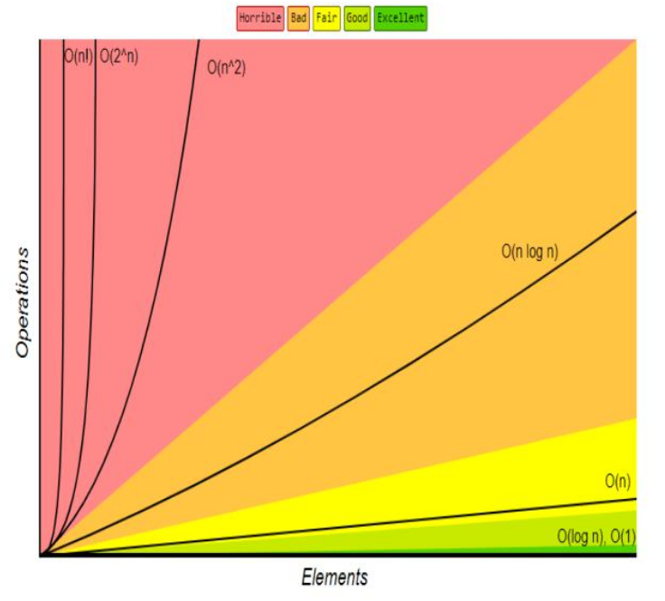

# Complejidad ALgoridmica

Consiste en comprender el crecimiento de recurso que necesita un algoridmo para procesar cierta cantidad de datos, para esto utilizaremos una notacion Big-O para esto analizaremos 2 recursos:

- **Tiempo** cuanto tarda en ejecutarce
- **Espacio** cuanto espacio ocupa

para eso utilizaremos Big-O y para sacar esa complejidad tenemos 2 formas:

### Analisis Asintotico

es generando un grafico con distintas entradas para ver como se comporta su grafica y asi sacar su complejidad utilizando asintotas( Asintota vertical horizontal y oblicuas ), con distintos tamaños de $n$.

misntras la asintota sea mas vetrtical se necesistaran mas recursos para ejecutar el algoritmo, aqui las zonas que tenemos que evitar y las donde esta bien tener la asintota:

### analisis teorico

es ver el codigo y analizarlo por ejemplo cada ejecucion es una accion y pára esto hay que ver si hay bucles si hay condicionales etc

hay distintas complejidadeas algoridmicas soin las siguientes:

- O(1) constante
- O(log n) Logaridmica
- O(n) Lineal
- O(n^2) Cuadratica
- O(2^n) Exponencial

## Algoritmo

Un algritmo es una susecion de instrucciones para solucionar un problema, es una estructura que mediante datos de entrada procesamos esos datos y generamos datos de salida.

    Nosotros necesitamos escoger un algordimo optimo y para eso lo analizamos con conplejidad algoridmica para medir su complejidad espacial y temporal

## Busqueda lineal

Busca todos los elementos manera secuancial, el peor caso es u numero elevado

## Busqueda binaria

Busca arrays ordenadas, va dividiendo y dividiendo hasta encontrar el numero

el peor caso es que no este ordenado los datos

## Ordenamiento burbuja

Va comparado dato por dato y se intercambia 

## ordenamiento por meszcla

es un algoritmo que divide por partes, primero divide una lista en partes iguales y van allegar al punto de nere 1 elemnto o 0 elementos y los va ordenando

## Ejericio

un avion ercules tranculaba dinero trasn el accidente se recuperaron multiples cajas con codigos de identificacion, cada caja tiene lo siguiente:

- codigo
- monto transportado
- prioridad de traslado
- estado de recuperacion

el equipo tecnico debe ordenar registros rapidamente debe analizar eficioncia debe tomar deciciones bajo restricciones de timpo y memoria

el sistema debe ordenar continuamente mientras llegan nuevos datos se tienen 200000 registros, memoria limitada tiempo critico se pide simular una entrada incremental comparar quick sort in place y marge sort tradicional
medir uso de memoria