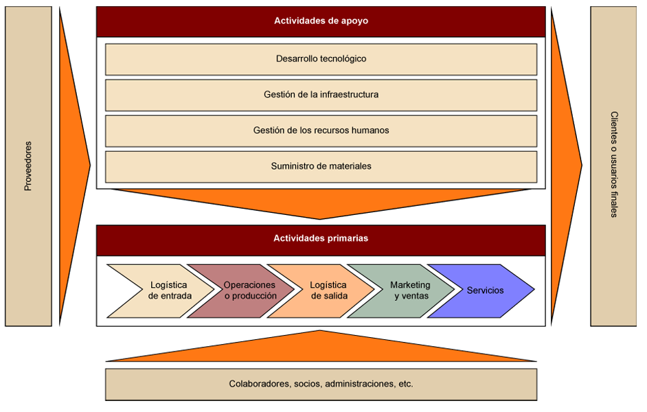

# Sistemas de Informacion

No solamante almacenan datos es un conjunto de elementos que permiten darle utilidad a esos datos.

## Que es

Es una manera estrategica de como guardad y generar estrategias con datos, no solamente es un programa, es un sitema que se basa en 4 principales elementos:

- **Personas.-** Aquellas que utilizan y gestionan los datos
- **Procedimientos.-** Son las normas y las reglas de como se manipularan esos datos
- **Datos.-** Son la materia prima los datos como tal
- **Recursos** es todo el hardware y la tecnologia que tenemos para ese sistema

## Fundamenteos de la informacion

### Dato

es la unidad basica de informacion por si sola no tiene significado

### Informacion

Es el dato con contexto nos sirve para darle un contexto al dato ya que por si solo no significa nada

### Conosismiento

es utilizar la informacion para tomar deciciones

---

### Propiedades de la informacion de calidad

La informacion tiene que cumplir ciertos criterios para que la informacion sea buena y nos permita tomar deciciones

- **significado** que se entienda que puedes entender
- **vigencia** que este calido al dia que lo vez
- **Valides** que sea real y coerente
- **valor** que te quite una duda y ayude a tomar deciciones

---

## Cadena de valor 

- **Actividades Primarias** es lo mas importante es lo que hace que el producto sa haga y salga a la venta 

- **Actividades Secundarias** la logistica para que funcionen las actividades primarias

---

## tipos de Sistemas

### Impementacion de sistema de informacion

Se implementa cuando hay una necesidad, cuando nececite generar algun tipo de control.

Etapas criticas:
- **Adopcion.-** Evalucion de necesidades y beneficios
- **Seleccion.-** Elegir la solucion tecnica adecuada
- **Gestion del cambio.-** Formacion y comunicacion a los usuarios

### Seguridad de la informacion
Aplicar las tecnicas necesarias para proteger dicha informacion.
- **Activo valioso.-** Protejer los datos
- **Cumplimiento.-** Seguir las normativas de la institucion a que normas se rije 
- **Seguridad integral.-** 

# Concluciones
Tenemos que ver que el sistema de informacion a que apunta cuan es su objetivo, requiere una administracion cordinada entre direccion y gestion, la tecnologia que acompañe depende del tiempo de actualizacion, acordes a la demanda de la organizacion

## Modelo lineal

Analisis -> Diseño -> Codigo -> Pruebas

## Modelo cascada

Tiene 5 faces para trabajar 

autor presma

- **Comunucacion** genera el inicio del proyecto y recabar los requirimientos, deberias recopilar informacion, y definir objetivos del proyecto y definir alcance y limites e identificamos los problemas.

- **Planeacion** se hace 3 tareas importantes, la primera estimacion, no se puede dar tiempo, costos y la distribucion de responsabilidades exacto por eso se hace una estimacion, se hace una programacion de esos tiempos, ( Diagrama Gand ), y generar un seguimiento de las tareas que definimos, emmpieza en planificacion y termina cuando termina el modelo

- **Modelado** primero se de la etapa de analisis y luego diseño. Aplicamos el principio de modularidad (divide y venseras) el sistema se divide en partes y se modela cada uno 

- **Costruccion** Generamos codigo y pruebas con pequeños bloques de codigo

- **Despliegue** igual se hacen pruebas

<Estudiar es el modelo mas importante este el de cascada>

autor muller

- Definicion
- Analisis
- Diseño
- Desarrollo
- Pruebas
- Mantenimiento

## modelo de construccion de prototipos

Busca recolectar atrabaes de un prototipo los requerimientos del sistema, costiste que le presentes un prototipo propio o no propio al cliente para que identifique lo que quiere.

etapas clasica:

tiene un siclo:

- Comunicacion
- Plan rapido
- Modelado diseño rapido
- Construccion del Prototipo
- Desarrollo entrega retroalimentacion

## Modelo de desarrollo rapido de aplicaciones DRA

se separa por equipos, y trabajan de manera simultanea, se necesita dividir en parte para distribuir a los equipos, basado en lineal secuencial

## modelo evolutivos

### Modelo incremental 

va avanzndo por incrementos cada infremento tiene analisis, diseño, codigo y pruebas, un incremento es como una iteracion, cada incremento es un avance osea agrefa funcionalidades o mejoras de sistema

### Modelo Espiral

- comunicacion con el cliente
- planificacion
- Analizis de riezgos 
- ingenieria
- construccion y adptacion
- evaluacion del criterio

cada vuelta es una iteracion

### Espira WINWIN (gana y gana)

toma las bases del modelo espurar pero hacemos enfacis en la comunicacion con el cliente, el objetivo es que ambas partes ganen clientes y desarrolladores

<estudiar lo que falta libro ingenieria de sistemas hasta el cap 3>

# Capitulo 3

Este capitulo habla sobre los roles de un sistema de informacion, y que no solamente es software y hardware sino que es una convivencia entre distiendos roles para que este funcione.

abarca los siguientes roles:

- Usuarios
- Analista de sistemas
- Diseñadores de sisetmas
- Administrador o generencia
- Auditores, personal de control de calidad
- Programadores
- Personal de operaciones

## Analista de sistemas

- **Arqueologo** saber que informacion almacenar, busca los requerimientos y investiga que se necesita 
- **inovador** busca nuevas ideas para proponer una solucion, que inove en propuestas
- **Mediador** 
- **Lider** tienes distintas caracteristicas de lider sabe liderar y es multidiciplinario y sabe expreserse en publico con facilidad

## Diseñador de sistemas

no trabaja directamente con los usuarios sabe mucho sobre datos tecnicos es el que ve el "COMO" tiene un nivel de abstraccion elevado, genera los panos tecnicos del sistema

## Programador

es el que traduce el diceño el plano tecnico del sistema a codigo y lo lleva a acabo, corregir errores

## Personal de operaciones 

Son los que mantienen vivo el sistema, ven que la parte fisica pueda mantener el sistema
